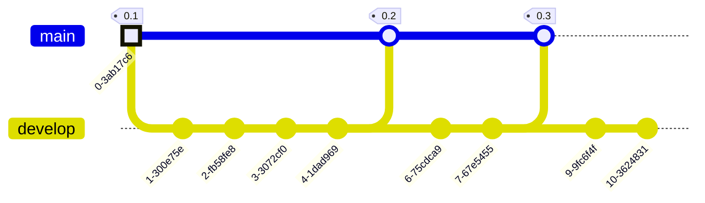
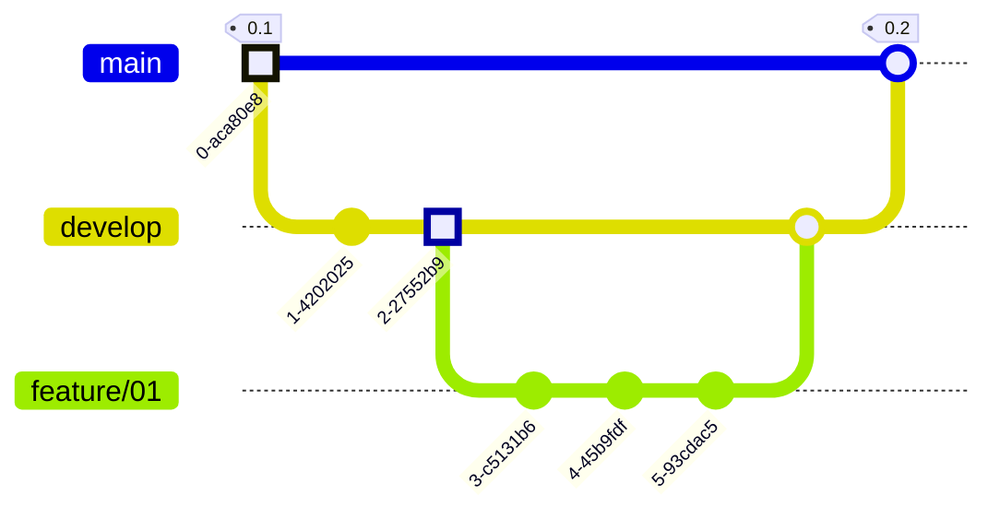
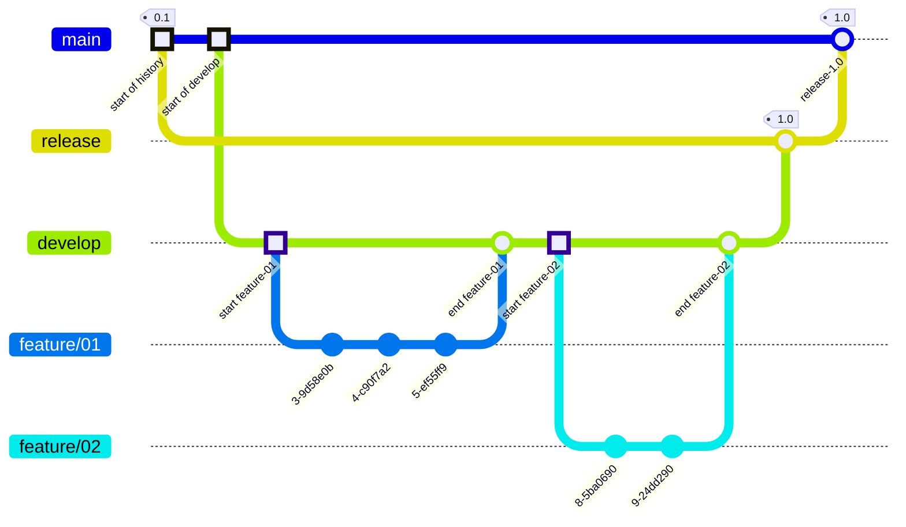

# Master-Develop Model

```mermaid
gitGraph

    checkout main
        commit type:HIGHLIGHT tag: "0.1"

    branch develop

    checkout develop
        commit
        commit
        commit
        commit

    checkout main
        merge develop tag: "0.2"

    checkout develop
        commit
        commit

    checkout main
        merge develop tag: "0.3"

    checkout develop
        commit
        commit

```

# Supporting Branches

## Creating a Feature Branch

```mermaid
gitGraph

    checkout main
        commit tag: "0.1" type:HIGHLIGHT

    branch develop

    checkout develop
        commit
        commit type:HIGHLIGHT

    branch feature/01

    checkout feature/01
        commit
        commit
        commit

    checkout develop
        merge feature/01

    checkout main
        merge develop tag: "0.2"
```

## Multiple Features with Release

```mermaid
gitGraph

    %% start MAIN %%
    checkout main
        commit tag: "0.1" id: "start of history" type:HIGHLIGHT

    %% create RELEASE %%
    branch release

    %% back to MAIN to start DEVELOP %%
    checkout main
        commit id: "start of develop" type:HIGHLIGHT

    branch develop

    %% FEATURE-01 lifecycle %%
    checkout develop
        commit id: "start feature-01" type:HIGHLIGHT

    branch feature/01

    checkout feature/01
        commit
        commit
        commit

    checkout develop
        merge feature/01 id: "end feature-01"

    %% FEATURE-02 lifecycle %%
    checkout develop
        commit id: "start feature-02" type:HIGHLIGHT

    branch feature/02

    checkout feature/02
        commit
        commit

    checkout develop
        merge feature/02 id: "end feature-02"

    %% No new features, ready for RELEASE 1.0 %%
    checkout release
        merge develop tag: "1.0"

    %% Bring release into main %%
    checkout main
        merge release tag: "1.0" id: "release-1.0"

```
